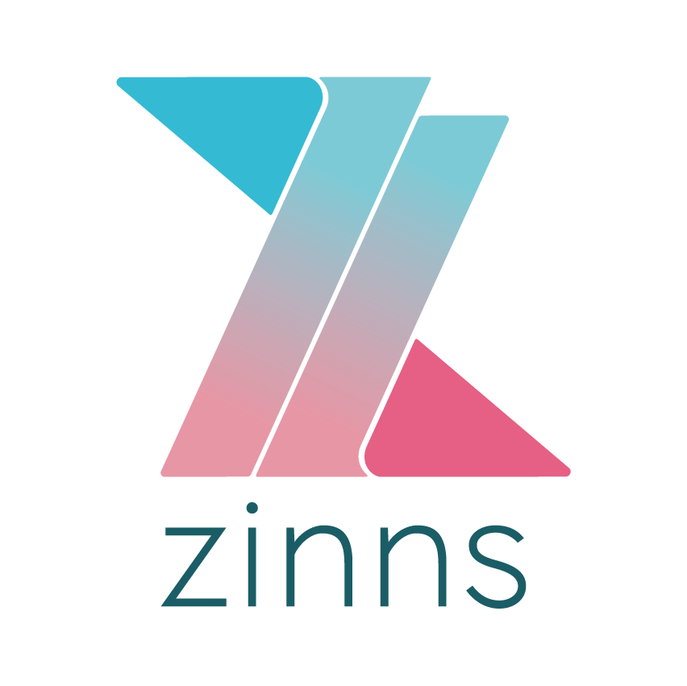

[Español](#curso-css)

[English](#css-course)

---

| Unit / Unidad | Topic / Tema | Completed / Completado |
| :-----------: | :----------: | :--------------------: |
|               |              |                        |
|               |              |                        |
|               |              |                        |
|               |              |                        |
|               |              |                        |
|               |              |                        |
|               |              |                        |
|               |              |                        |
|               |              |                        |
|               |              |                        |
|               |              |                        |
|               |              |                        |

---

# CSS Course

This repository contains folders related to the topics that are part of this section of the course. Each folder contains specific instructions and corresponding exercise(s).

### Reminders

- The first time this repo has been cloned please run this script `yarn`.

- There is branch called `develop-padawans`. Remember always start to work from this branch.

- Branch naming always has to be following the conventions.

- Commits should always be meaningful.

- PR's should always point to `develop-padawans`.

- PR's should always have reviewers.

- Once topic's exercise(s) is completed mark it as done in the table using -> ✅

---

# Curso CSS

Este repositorio contiene carpetas relacionadas con los temas que forman parte de esta sección del curso. Cada carpeta contiene sus instrucciones específicas y ejercicio(s) correspondientes.

### Recordatorios

- La primera vez que este repo haya sido clonado, por favor correr este script `yarn`.

- Existe una rama llamada `develop-padawans`. Siempre se debe de empezar a trabajar desde esta rama.

- Nombre de las ramas siempre deben seguir las convenciones.

- Commits siempre deben de ser informativos.

- PR's siempre deben apuntar a `develop-padawans`.

- PR's siempre deben de tener reviewers.

- Una vez que los ejercicios del tema sean completados, marcar dentro de la tabla usando -> ✅
