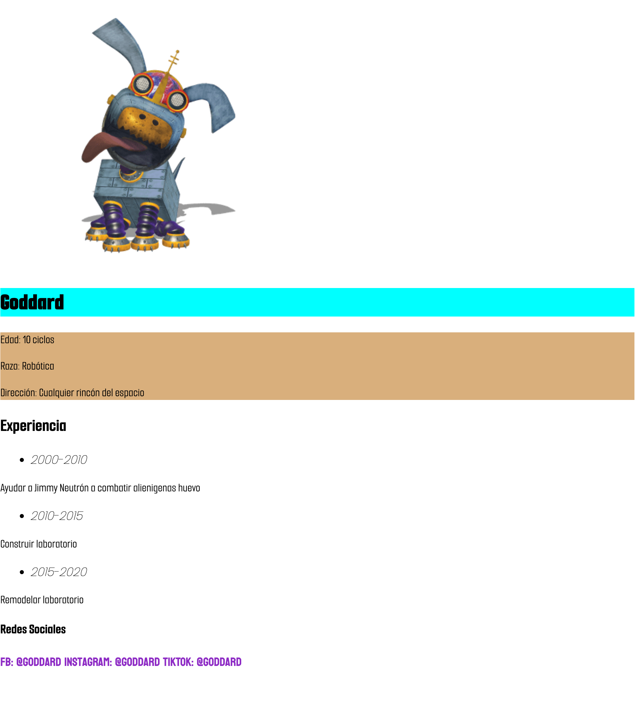

[Español](#Instrucciones)

[English](#Instructions)

---

# Instructions

1. Write a list of 10 desired things and modify each thing styles.

2. In another branch, write 3 stanzas of any song and modify their styles but some verses should share some styles.

3. In other branch write a small work experience resume and modify their styles.

> Example
> 

# Reminders

- Remember using every unit/value of each property.

- Remember always use Semantic HTML.

---

# Instrucciones

1. Escribir una lista de 10 cosas deseadas y modificar el estilo de cada una.

2. En otra rama escribir 3 estrofas de cualquier canción y modificar sus estilos pero algunos versos deberán compartir estilos.

3. En otra rama escribir un pequeño resumen de experiencia laboral y modificar sus estilos.

> Ejemplo
> 

# Recordatorios

- Usar cada unidad/valor de cada propiedad.

- Siempre se debe usar HTML semántico
