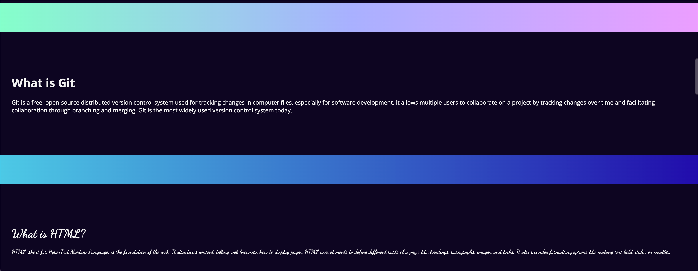

[Español](#Instrucciones)

[English](#Instructions)

---

# Instructions

1. Each developer is going to choose a task and work independently.

2. Prototype the next example.

> example
> 

3. Each part should created separately with its divider.

> What is Git - Branch feat/git-summary
>
> Divider - Branch feat/divider

4. Once the development of each text is finished, the developer should open a PR with the changes and request an approval from the other developer.

5. The developer can work in a new button while the PR is being approved but the final UI should look as it was requested.

## Tasks

1. Change full background color to -> #0D0221.

2. Create first divider - use this page to get a [gradient](https://coolors.co/gradients).

3. Add the Git Summary using this text and its typography (Open Sans)

> Git is a free, open-source distributed version control system used for tracking changes in computer files, especially for software development. It allows multiple users to collaborate on a project by tracking changes over time and facilitating collaboration through branching and merging. Git is the most widely used version control system today.

4. Create second divider - use this page to get a [gradient](https://coolors.co/gradients).

5. Add the HTML Summary using this text and its typography (Dancing Script)

> HTML, short for HyperText Markup Language, is the foundation of the web. It structures content, telling web browsers how to display pages. HTML uses elements to define different parts of a page, like headings, paragraphs, images, and links. It also provides formatting options like making text bold, italic, or smaller.

# Reminders

- Remember using every unit/value of each property.

- Remember always use Semantic HTML.

---

# Instrucciones

1. Cada desarrollador escogerá una tarea y trabajará individualmente.

2. Prototipar el siguiente ejemplo.

   > ejemplo
   > 

3. Cada parte deberá ser creada separadamente.

> What is Git - Branch feat/git-summary
>
> Divider - Branch feat/divider

4. Una vez que el desarrollo de cada texto esté terminado, el desarrollador abrirá una PR con los cambios y solicitará aprobación del otro desarrollador.

5. El desarrollador puede trabajar en un nuevo botón mientras la PR es aprobada pero la versión final deberá lucir como fue solicitado.

### Tareas

1. Cambiar el color de fondo a este -> #0D0221.

2. Crear el primer divisor - usar esta página para obtener un [gradiente](https://coolors.co/gradients).

3. Agregar el resumen de Git usando este texto y su tipografía (Open Sans)

> Git is a free, open-source distributed version control system used for tracking changes in computer files, especially for software development. It allows multiple users to collaborate on a project by tracking changes over time and facilitating collaboration through branching and merging. Git is the most widely used version control system today.

4. Crear el segundo divisor - usar esta página para obtener un [gradiente](https://coolors.co/gradients).

5. Agregar el resumen de HTML usando este texto y su tipografía (Dancing Script)

> HTML, short for HyperText Markup Language, is the foundation of the web. It structures content, telling web browsers how to display pages. HTML uses elements to define different parts of a page, like headings, paragraphs, images, and links. It also provides formatting options like making text bold, italic, or smaller.

# Recordatorios

- Usar cada unidad/valor de cada propiedad.

- Siempre se debe usar HTML semántico
