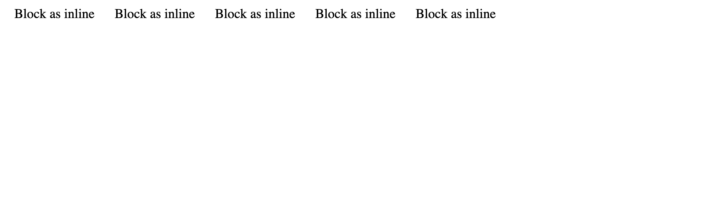
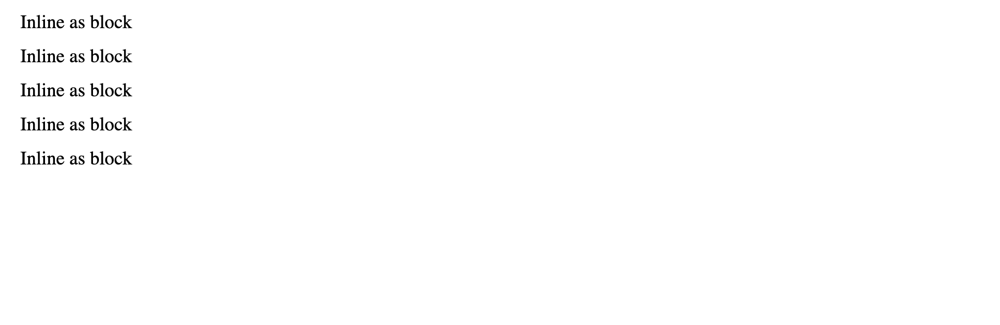
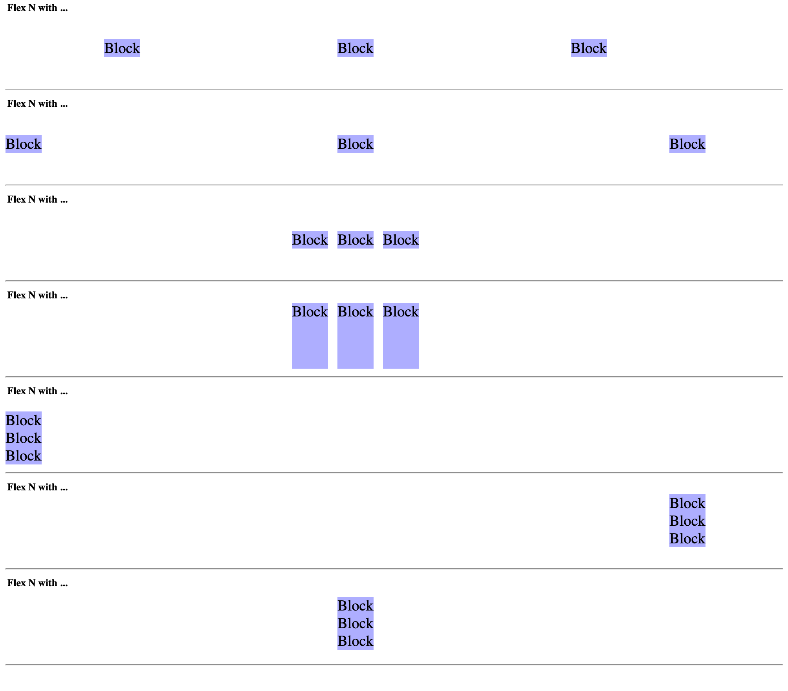

[Español](#Instrucciones)

[English](#Instructions)

---

# Instructions

1. Write 10 container tags and make them look like the next example.

   > example
   > 

2. Write 10 inline tags and make them look like the next example.

   > example
   > 

3. Prototype all flex scenarios like the next example and write the conditions of each scenario.
   > example
   > 

# Reminders

- Remember using every unit/value of each property.

- Remember always use Semantic HTML.

---

# Instrucciones

1. Escribir 10 etiquetas de contenedores y hacer que luzcan como el siguiente ejemplo.

   > ejemplo
   > 

2. Escribir 10 etiquetas inline y hacer que luzcan como el siguiente ejemplo.

   > example
   > 

3. Prototipar todos los escenarios de flex como el siguiente ejemplo y escribir las condiciones de cada escenario.
   > example
   > 

# Recordatorios

- Usar cada unidad/valor de cada propiedad.

- Siempre se debe usar HTML semántico
