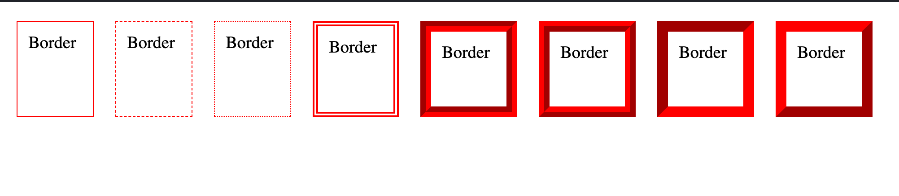
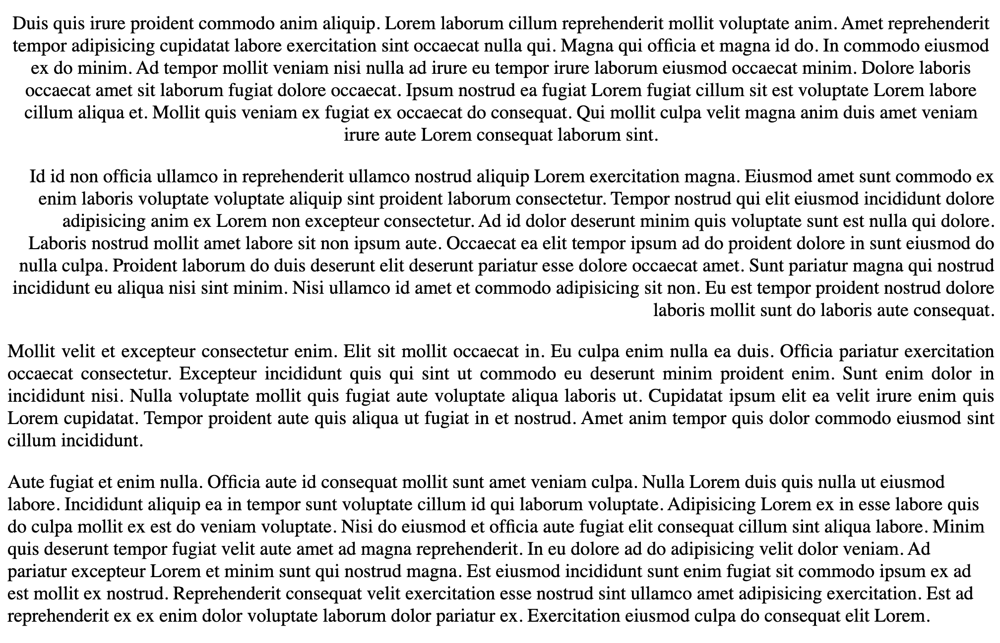
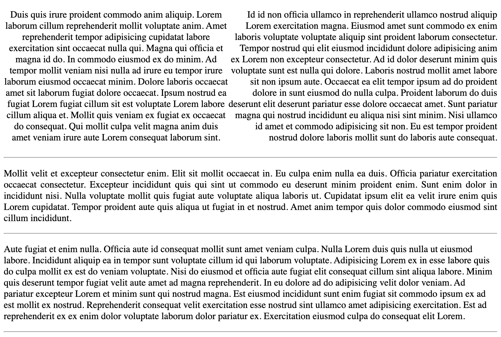

[Español](#Instrucciones)
[English](#Instructions)

---

# Instructions

1. Prototype the next example.

   > example
   > 

2. In other branch prototype the next example.

   > example
   > 

3. In other branch prototype the next example.

   > example
   > 

## Reminders

- Remember using every unit/value of each property.

- Remember always use Semantic HTML.

---

# Instrucciones

1. Prototipar el siguiente ejemplo.

   > ejemplo
   > 

2. En otra rama prototipar el siguiente ejemplo.

   > example
   > 

3. En otra rama prototipar el siguiente ejemplo.

   > example
   > 

## Recordatorios

- Usar cada unidad/valor de cada propiedad.

- Siempre se debe usar HTML semántico
