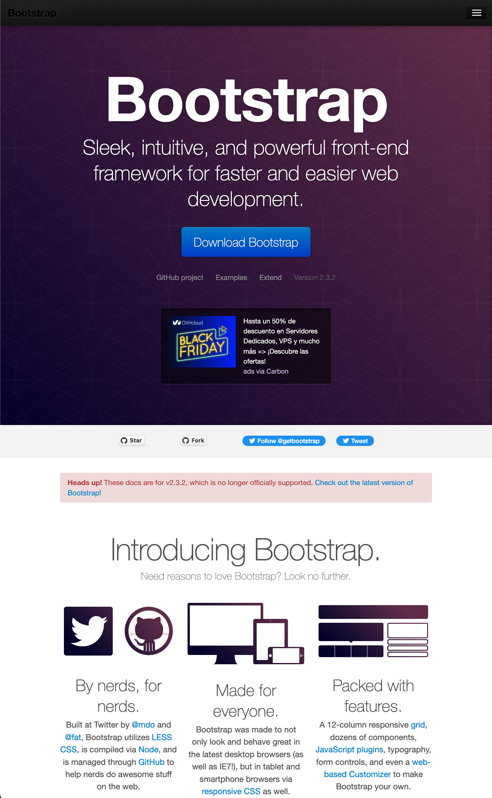
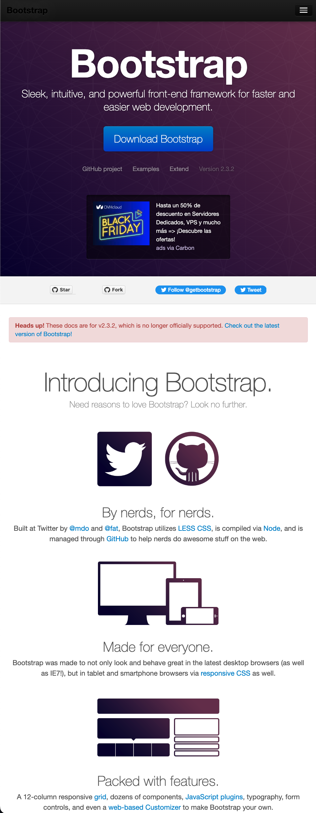

[Español](#Instrucciones)

[English](#Instructions)

---

# Instructions

1. Prototype the next webpage using Bootstrap and following the ideal development workflow.

2. The website should be responsive.

3. Images, icons and fonts should be similar.

   > Desktop
   > 

   > Tablet
   > 

   > Mobile
   > 

## Reminders

- Remember using every unit/value of each property.

- Remember always use Semantic HTML.

---

## Instrucciones

1. Prototipar la siguiente página web usando Bootstrap y siguiendo el proceso de desarrollo ideal.

   > Escritorio
   > 

   > Tablets
   > 

   > Móvil
   > 

# Recordatorios

- Usar cada unidad/valor de cada propiedad.

- Siempre se debe usar HTML semántico
