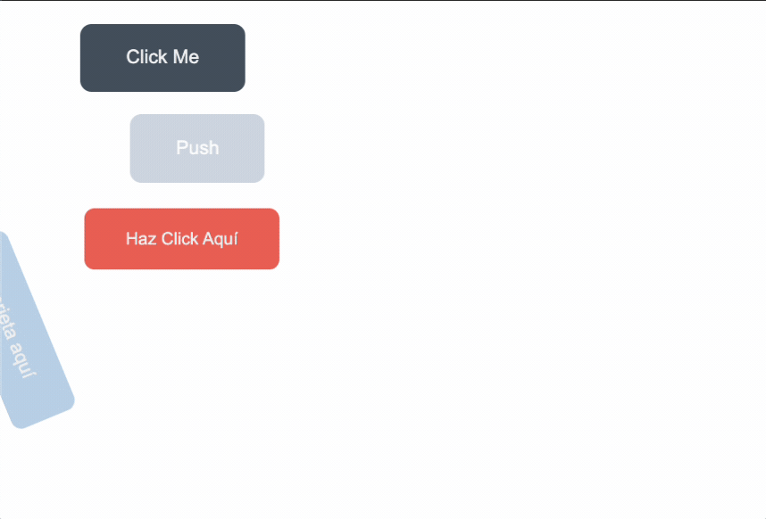

[Español](#Instrucciones)

[English](#Instructions)

---

# Instructions

1. Each developer is going to choose a task and work independently.

2. Prototype the next example.

> example
> 

3. Each button should be created separately.

> Button 1 - Branch feat/button-1
>
> Button 2 - Branch feat/button-2

4. Once the development of each button is finished, the developer should open a PR with the changes and request an approval from the other developer.

5. The developer can work in a new button while the PR is being approved but the final UI should look as it was requested.

## Tasks

1. Connect the css Style file with the HTML.

2. Add the missing meta tags.

3. Create Button 1

4. Create Button 2

5. Create Button 3

6. Create Button 4

# Reminders

- Remember using every unit/value of each property.

- Remember always use Semantic HTML.

---

# Instrucciones

1. Cada desarrollador escogerá una tarea y trabajará individualmente.

2. Prototipar el siguiente ejemplo.

   > ejemplo
   > 

3. Cada botón deberá ser creado separadamente.

> Botón 1 - Branch feat/button-1
>
> Botón 2 - Branch feat/button-2

4. Una vez que el desarrollo de cada botón esté terminado, el desarrollador abrirá una PR con los cambios y solicitará aprobación del otro desarrollador.

5. El desarrollador puede trabajar en un nuevo botón mientras la PR es aprobada pero la versión final deberá lucir como fue solicitado.

### Tareas

1. Conectar el archivo CSS con el HTML.

2. Agregar la etiquetas meta faltantes.

3. Crear Botón 1

4. Crear Botón 2

5. Crear Botón 3

6. Crear Botón 4

# Recordatorios

- Usar cada unidad/valor de cada propiedad.

- Siempre se debe usar HTML semántico
